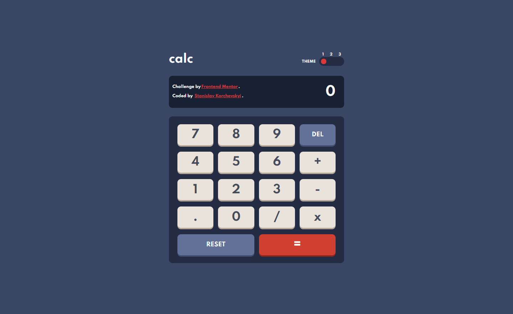

# Frontend Mentor - Calculator app

## by Stanislav Korchevskyi!

## Welcome! 👋

This is my solution for the challenge from [Frontend Mentor](https://www.frontendmentor.io).

**The challenge was to build out the calculator app and got it looking as close to the design as possible using HTML, CSS and JavaScript.**

[Check out my calculator](https://www.frontendmentor.io/slack)
